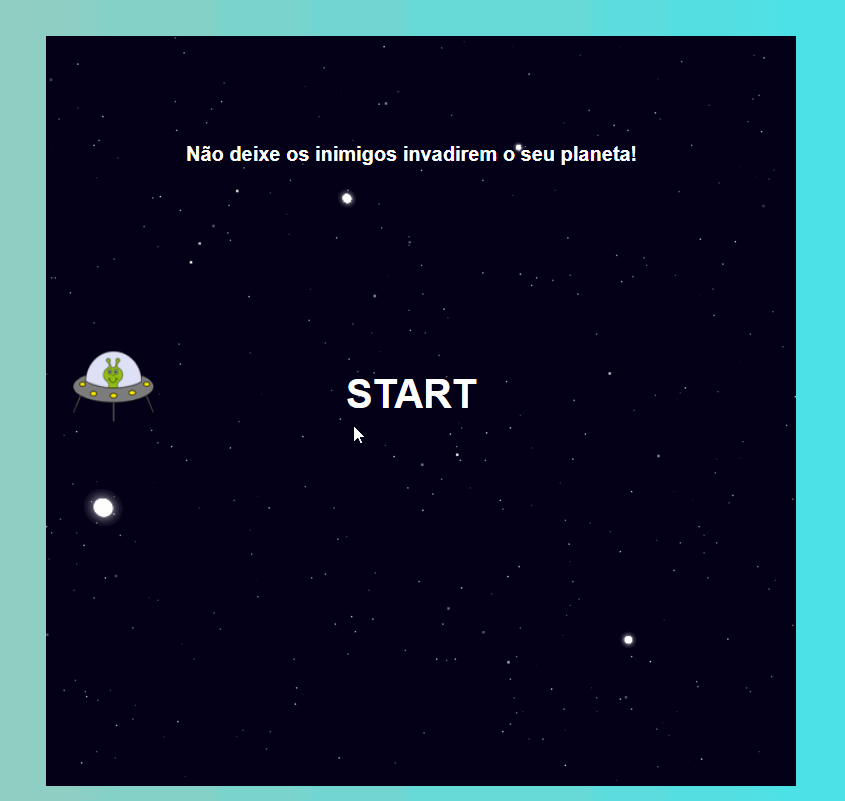

 <h1 align="center">Space Shoote</h1>

 
</img>

---

 
O desafio foi criar um Space Shooter utilizando HTML, CSS e Javascript.  Aprenderemos juntos a trabalhar com posicionamento no CSS e lógica de programação utilizando posicionamento com CSS, manipulação do DOM, eventListeners, e manipulação de Array.

 ---

### Tecnologias:

- [HTML](https://developer.mozilla.org/en-US/docs/Glossary/HTML)
- [CSS](https://developer.mozilla.org/en-US/docs/Web/CSS)
- [JavaScript](https://developer.mozilla.org/en-US/docs/Web/JavaScript)
---
### **Para jogar** :

1. Clonar o repositório - `git clone`
2. Abra o - `index.html` 
3. Play 

---
<h3>Créditos :</h3>

- Gabriela Pinheiro [GitHub](https://github.com/SpruceGabriela).

- Bootcamp [Digital Innovation One](https://digitalinnovation.one/).
---

|        [Erick F.](https://github.com/Nic-Developer)         |
| :---------------------------------------------------------: |
|  |